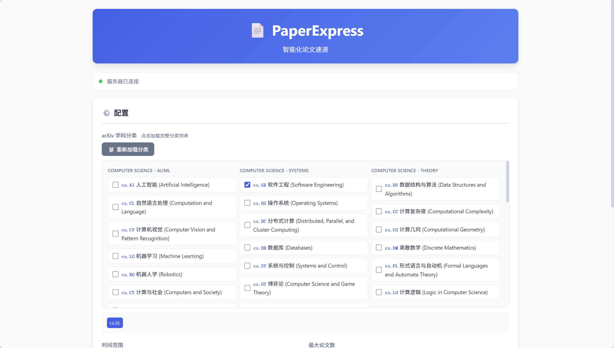
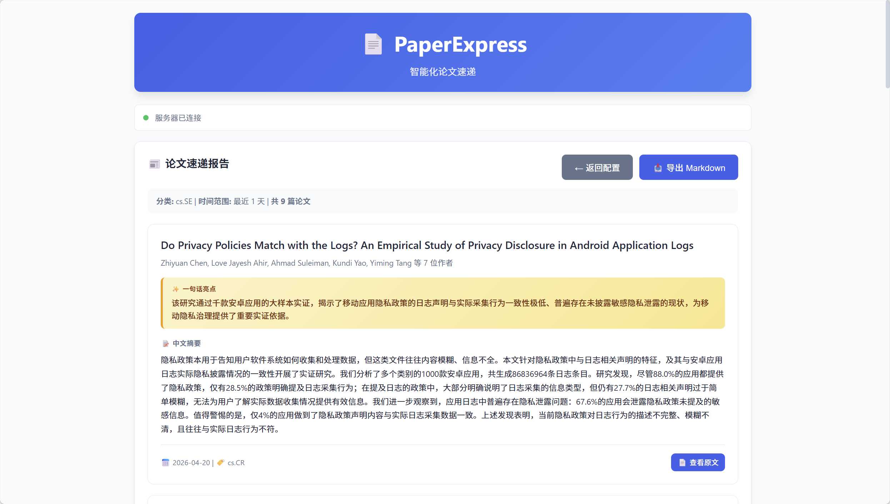

# 📄 PaperExpress

概述：智能化论文速递 - 自动获取 arXiv 最新论文，通过 LLM 翻译生成中文摘要和亮点。

<div style="display: flex; gap: 10px; flex-wrap: wrap;">
  
  
</div>

## 更新日志

- 2026-04-21: 最小可运行版本落地，支持 arXiv 获取 + LLM 翻译 + Markdown 导出

## 功能

- **论文获取**：从arXiv获取指定主题的最新论文（支持 39 个计算机学科 arXiv 分类）
- **自动翻译**: LLM 翻译摘要 + 提炼一句话亮点，支持任意 OpenAI 兼容接口
- **导出报告**: 翻译完成后导出 Markdown 文件

## 快速开始

### 1. 启动服务

```bash
python server.py
```

服务默认启动在 `http://localhost:8080`，浏览器打开即可使用。

### 2. 配置 LLM

在项目根目录创建 `config.json`:

```json
{
  "endpoint": "https://ark.cn-beijing.volces.com/api/coding/v3",
  "key": "your-api-key",
  "model": "doubao-seed-2.0-lite"
}
```

然后在页面点击「📂 加载配置」即可自动填充。也可以手动填写。

### 3. 使用流程

1. 点击「📋 加载完整学科分类」
2. 勾选你关注的分类
3. 选择时间范围和最大论文数
4. 点击「🔗 测试连接」验证 API
5. 点击「🚀 开始生成论文速递」
6. 等待翻译完成后导出 Markdown
